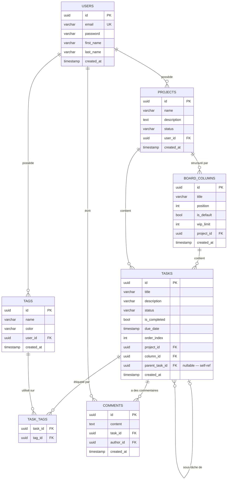
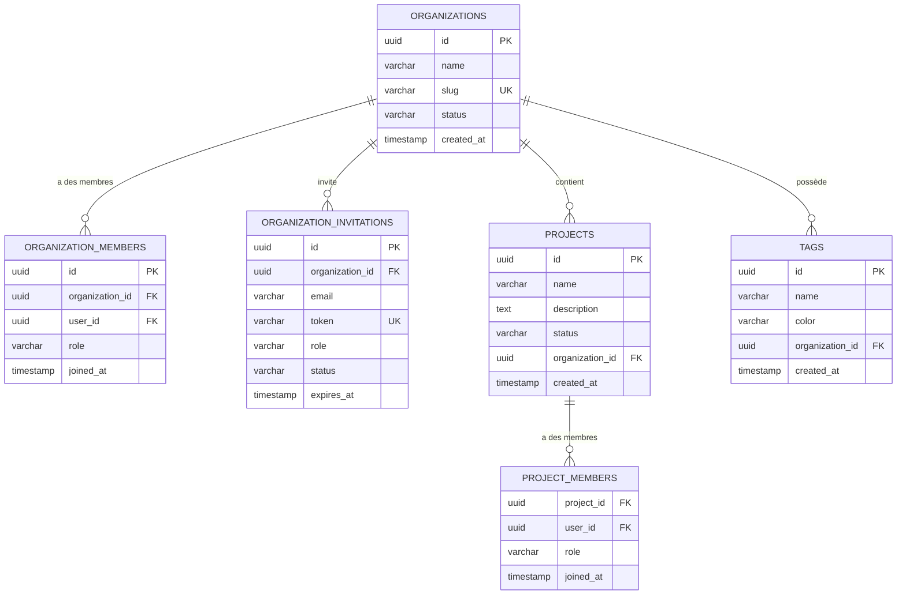

# Évolution du Schéma — POC → MVP → Phase 3

> 16 tables au total · 0 migration cassante (sauf TM02-UPD : Expand/Contract documenté ci-dessous)
>
> Principe : **toutes les migrations sont additives** (ADD COLUMN nullable, CREATE TABLE).

---

## Notation Merise → Mermaid

Les diagrammes utilisent la syntaxe Mermaid `erDiagram`, équivalente au MCD Merise :

| Merise (MCD) | Mermaid | Signification |
|-------------|---------|---------------|
| `(1,1)` | `\|\|` | Exactement un |
| `(0,1)` | `\|o` | Zéro ou un |
| `(1,N)` | `\|{` | Un ou plusieurs |
| `(0,N)` | `o{` | Zéro ou plusieurs |

Lecture : `A \|\|--o{ B` = un A est lié à zéro ou plusieurs B ; un B est lié à exactement un A.

---

## Phase 0 — MVP Perso

**Objectif** : app personnelle fonctionnelle — un utilisateur, ses projets, ses tâches. Sans organisation multi-tenant.

### Tables créées (3)

```sql
CREATE TABLE users (
    id         UUID PRIMARY KEY,
    email      VARCHAR(255) UNIQUE NOT NULL,
    password   VARCHAR(255) NOT NULL,
    first_name VARCHAR(100) NOT NULL,
    last_name  VARCHAR(100) NOT NULL,
    created_at TIMESTAMP NOT NULL DEFAULT NOW(),
    updated_at TIMESTAMP NOT NULL DEFAULT NOW()
);

CREATE TABLE projects (
    id          UUID PRIMARY KEY,
    name        VARCHAR(255) NOT NULL,
    description TEXT,
    status      VARCHAR(20) NOT NULL DEFAULT 'active',   -- active | on_hold | completed
    user_id     UUID NOT NULL REFERENCES users(id) ON DELETE CASCADE,
    created_at  TIMESTAMP NOT NULL DEFAULT NOW(),
    updated_at  TIMESTAMP NOT NULL DEFAULT NOW()
);

CREATE TABLE board_columns (
    id         UUID PRIMARY KEY,
    title      VARCHAR(100) NOT NULL,
    position   INTEGER NOT NULL DEFAULT 0,
    project_id UUID NOT NULL REFERENCES projects(id) ON DELETE CASCADE,
    is_default BOOLEAN NOT NULL DEFAULT FALSE,
    wip_limit  INTEGER,
    created_at TIMESTAMP NOT NULL DEFAULT NOW(),
    updated_at TIMESTAMP NOT NULL DEFAULT NOW(),
    UNIQUE (project_id, position)
);

CREATE TABLE tasks (
    id            UUID PRIMARY KEY,
    title         VARCHAR(255) NOT NULL,
    description   VARCHAR(2000),
    status        VARCHAR(20) NOT NULL DEFAULT 'todo',   -- todo | in_progress | in_review | done
    is_completed  BOOLEAN NOT NULL DEFAULT FALSE,
    due_date      TIMESTAMP,
    order_index   INTEGER NOT NULL DEFAULT 0,
    project_id    UUID NOT NULL REFERENCES projects(id) ON DELETE CASCADE,
    column_id     UUID REFERENCES board_columns(id) ON DELETE SET NULL,
    parent_task_id UUID REFERENCES tasks(id) ON DELETE SET NULL,  -- sous-tâches (1 niveau)
    created_at    TIMESTAMP NOT NULL DEFAULT NOW(),
    updated_at    TIMESTAMP NOT NULL DEFAULT NOW()
);

CREATE TABLE tags (
    id         UUID PRIMARY KEY,
    name       VARCHAR(100) NOT NULL,
    color      VARCHAR(7) NOT NULL DEFAULT '#6B7280',
    user_id    UUID NOT NULL REFERENCES users(id) ON DELETE CASCADE,
    created_at TIMESTAMP NOT NULL DEFAULT NOW(),
    updated_at TIMESTAMP NOT NULL DEFAULT NOW()
);

CREATE TABLE task_tags (
    task_id UUID NOT NULL REFERENCES tasks(id) ON DELETE CASCADE,
    tag_id  UUID NOT NULL REFERENCES tags(id)  ON DELETE CASCADE,
    PRIMARY KEY (task_id, tag_id)
);

CREATE TABLE comments (
    id         UUID PRIMARY KEY,
    content    TEXT NOT NULL,
    task_id    UUID NOT NULL REFERENCES tasks(id) ON DELETE CASCADE,
    author_id  UUID NOT NULL REFERENCES users(id),
    created_at TIMESTAMP NOT NULL DEFAULT NOW(),
    updated_at TIMESTAMP NOT NULL DEFAULT NOW()
);
```

### Diagramme MCD — MVP Perso



### API exposée — MVP Perso

| Méthode | URI | Description |
|---------|-----|-------------|
| POST | /api/auth/token | Obtenir un token OAuth2 |
| GET | /api/me | Profil de l'utilisateur connecté |
| GET/POST | /api/projects | Lister / créer des projets |
| GET/PUT/DELETE | /api/projects/{id} | Lire / modifier / supprimer |
| GET/POST | /api/projects/{id}/columns | Colonnes Kanban |
| GET/POST | /api/projects/{id}/tasks | Lister / créer des tâches |
| GET/PATCH/DELETE | /api/tasks/{id} | Détail / mise à jour / suppression |
| PATCH | /api/tasks/{id}/transitions/{name} | Changer le statut (Workflow) |
| GET/POST | /api/tasks/{id}/subtasks | Sous-tâches |
| GET/POST | /api/tasks/{id}/comments | Commentaires |
| GET/POST | /api/tags | Tags de l'utilisateur |
| POST/DELETE | /api/tasks/{id}/tags/{tagId} | Associer / dissocier un tag |

---

## Phase 2.5 — Dépendances inter-tâches

**Objectif** : permettre à une tâche d'en bloquer une autre (DAG, détection de cycle).

### Migration additive

```sql
CREATE TABLE task_dependencies (
    id                 UUID PRIMARY KEY,
    waiting_on_task_id UUID NOT NULL REFERENCES tasks(id) ON DELETE CASCADE,
    blocking_task_id   UUID NOT NULL REFERENCES tasks(id) ON DELETE CASCADE,
    created_at         TIMESTAMP NOT NULL DEFAULT NOW(),
    UNIQUE (waiting_on_task_id, blocking_task_id)
);
```

---

## Pivot SaaS — Organisation multi-tenant

**Objectif** : transformer l'app perso en SaaS. Un utilisateur peut appartenir à plusieurs organisations.

### Migrations (Expand/Contract pour `projects`)

```sql
-- Étape 1 : CREATE nouvelles tables
CREATE TABLE organizations (
    id         UUID PRIMARY KEY,
    name       VARCHAR(255) NOT NULL,
    slug       VARCHAR(100) UNIQUE NOT NULL,
    status     VARCHAR(20) NOT NULL DEFAULT 'active',   -- active | suspended
    created_at TIMESTAMP NOT NULL DEFAULT NOW(),
    updated_at TIMESTAMP NOT NULL DEFAULT NOW()
);

CREATE TABLE organization_members (
    id              UUID PRIMARY KEY,
    organization_id UUID NOT NULL REFERENCES organizations(id) ON DELETE CASCADE,
    user_id         UUID NOT NULL REFERENCES users(id)         ON DELETE CASCADE,
    role            VARCHAR(20) NOT NULL DEFAULT 'member',   -- owner | admin | member
    joined_at       TIMESTAMP NOT NULL DEFAULT NOW(),
    UNIQUE (organization_id, user_id)
);

CREATE TABLE organization_invitations (
    id              UUID PRIMARY KEY,
    organization_id UUID NOT NULL REFERENCES organizations(id) ON DELETE CASCADE,
    email           VARCHAR(255) NOT NULL,
    token           VARCHAR(64) UNIQUE NOT NULL,
    role            VARCHAR(20) NOT NULL DEFAULT 'member',
    status          VARCHAR(20) NOT NULL DEFAULT 'pending',   -- pending | accepted | cancelled | expired
    expires_at      TIMESTAMP NOT NULL,
    created_at      TIMESTAMP NOT NULL DEFAULT NOW()
);

CREATE TABLE project_members (
    project_id UUID NOT NULL REFERENCES projects(id) ON DELETE CASCADE,
    user_id    UUID NOT NULL REFERENCES users(id)    ON DELETE CASCADE,
    role       VARCHAR(20) NOT NULL DEFAULT 'member',
    joined_at  TIMESTAMP NOT NULL DEFAULT NOW(),
    PRIMARY KEY (project_id, user_id)
);

-- Étape 2 : EXPAND — ajouter org_id nullable sur projects (sans casser l'existant)
ALTER TABLE projects ADD COLUMN organization_id UUID REFERENCES organizations(id);

-- Étape 3 : DATA MIGRATION — backfill organization_id à partir de user_id
-- (script de migration à écrire selon la logique métier — ex: 1 org par user)

-- Étape 4 : CONTRACT — rendre org_id NOT NULL, supprimer user_id
ALTER TABLE projects ALTER COLUMN organization_id SET NOT NULL;
ALTER TABLE projects DROP COLUMN user_id;

-- Étape 5 : migrer tags de user_id → organization_id
ALTER TABLE tags ADD COLUMN organization_id UUID REFERENCES organizations(id);
-- backfill via organization_members
ALTER TABLE tags ALTER COLUMN organization_id SET NOT NULL;
ALTER TABLE tags DROP COLUMN user_id;
```

> **Note migration TM02-UPD** : seule migration non-triviale du projet.
> Utiliser le pattern Expand/Contract : les deux colonnes coexistent le temps du déploiement.
> Ref règle sécurité : voir section "Règle de sécurité migration" en bas de ce fichier.

### Diagramme MCD — Pivot SaaS (delta)



---

## Phase 3 — Fonctionnalités Avancées

**Objectif** : Teams, champs personnalisés (EAV), IAM avancé.

### Migrations additives

```sql
-- 1. Teams (IAM avancé)
CREATE TABLE teams (
    id              UUID PRIMARY KEY,
    name            VARCHAR(100) NOT NULL,
    organization_id UUID NOT NULL REFERENCES organizations(id) ON DELETE CASCADE,
    created_at      TIMESTAMP NOT NULL DEFAULT NOW(),
    updated_at      TIMESTAMP NOT NULL DEFAULT NOW()
);

CREATE TABLE team_members (
    team_id UUID NOT NULL REFERENCES teams(id) ON DELETE CASCADE,
    user_id UUID NOT NULL REFERENCES users(id) ON DELETE CASCADE,
    role    VARCHAR(20) NOT NULL DEFAULT 'member',
    PRIMARY KEY (team_id, user_id)
);

-- 2. Organization enrichie (enterprise)
ALTER TABLE organizations ADD COLUMN billing_plan       VARCHAR(20) NOT NULL DEFAULT 'free';
ALTER TABLE organizations ADD COLUMN logo               VARCHAR(500);
ALTER TABLE organizations ADD COLUMN is_suspended       BOOLEAN NOT NULL DEFAULT FALSE;
ALTER TABLE organizations ADD COLUMN integration_policy JSON;

-- 3. Project enrichi
ALTER TABLE projects ADD COLUMN key         VARCHAR(10);
ALTER TABLE projects ADD COLUMN owner_id    UUID REFERENCES users(id);
ALTER TABLE projects ADD COLUMN is_archived BOOLEAN NOT NULL DEFAULT FALSE;
ALTER TABLE projects ADD COLUMN is_private  BOOLEAN NOT NULL DEFAULT FALSE;

-- 4. Task enrichie (Phase 3)
ALTER TABLE tasks ADD COLUMN priority       VARCHAR(20) DEFAULT 'none';   -- none | low | medium | high | urgent
ALTER TABLE tasks ADD COLUMN story_points   INTEGER;
ALTER TABLE tasks ADD COLUMN reporter_id    UUID REFERENCES users(id);
ALTER TABLE tasks ADD COLUMN assignee_id    UUID REFERENCES users(id);
ALTER TABLE tasks ADD COLUMN completed_at   TIMESTAMP;
ALTER TABLE tasks ADD COLUMN path           VARCHAR(500);   -- Materialized Path
ALTER TABLE tasks ADD COLUMN depth          INTEGER NOT NULL DEFAULT 0;

-- 5. User enrichi
ALTER TABLE users ADD COLUMN is_service_account BOOLEAN NOT NULL DEFAULT FALSE;

-- 6. Champs personnalisés (pattern EAV)
CREATE TABLE custom_fields (
    id              UUID PRIMARY KEY,
    name            VARCHAR(100) NOT NULL,
    type            VARCHAR(20) NOT NULL,   -- text | number | dropdown
    options         JSON,                   -- ["Basse", "Normale", "Haute"] pour dropdown
    organization_id UUID NOT NULL REFERENCES organizations(id),
    created_at      TIMESTAMP NOT NULL DEFAULT NOW()
);

CREATE TABLE custom_field_values (
    id              UUID PRIMARY KEY,
    task_id         UUID NOT NULL REFERENCES tasks(id)         ON DELETE CASCADE,
    custom_field_id UUID NOT NULL REFERENCES custom_fields(id) ON DELETE CASCADE,
    value           VARCHAR(500),
    UNIQUE (task_id, custom_field_id)
);
```

---

## Récapitulatif des migrations

| Phase | Tables créées | Colonnes ajoutées | Risque |
|-------|--------------|-------------------|--------|
| **MVP Perso** | `users`, `projects`, `board_columns`, `tasks`, `tags`, `task_tags`, `comments` | — | — |
| **Phase 2.5** | `task_dependencies` | — | ✅ Aucun |
| **Pivot SaaS** | `organizations`, `organization_members`, `organization_invitations`, `project_members` | `projects`: org_id (Expand/Contract) · `tags`: org_id (Expand/Contract) | ⚠️ Expand/Contract |
| **Phase 3** | `teams`, `team_members`, `custom_fields`, `custom_field_values` | `organizations` ×4 · `projects` ×4 · `tasks` ×7 · `users` ×1 | ✅ Aucun |

**Total migrations cassantes : 1** (TM02-UPD — `project.user_id → project.org_id`, géré par Expand/Contract)

---

## Évolution par entité

### User

| Phase | Colonnes | Migrations |
|-------|----------|------------|
| **MVP Perso** | `id`, `email`, `password`, `first_name`, `last_name` | `CREATE TABLE users` |
| **Phase 3** | + `is_service_account` | `ADD COLUMN` ×1 |

### Project

| Phase | Colonnes | Migrations |
|-------|----------|------------|
| **MVP Perso** | `id`, `name`, `description`, `status`, `user_id` | `CREATE TABLE projects` |
| **Pivot SaaS** | `user_id` → `organization_id` | Expand/Contract |
| **Phase 3** | + `key`, `owner_id`, `is_archived`, `is_private` | `ADD COLUMN` ×4 |

### Task

| Phase | Colonnes | Migrations |
|-------|----------|------------|
| **MVP Perso** | `id`, `title`, `description`, `status`, `is_completed`, `due_date`, `order_index`, `project_id`, `column_id`, `parent_task_id` | `CREATE TABLE tasks` |
| **Phase 3** | + `priority`, `story_points`, `reporter_id`, `assignee_id`, `completed_at`, `path`, `depth` | `ADD COLUMN` ×7 |

### Organization

| Phase | Colonnes | Migrations |
|-------|----------|------------|
| **Pivot SaaS** | `id`, `name`, `slug`, `status` | `CREATE TABLE organizations` |
| **Phase 3** | + `billing_plan`, `logo`, `is_suspended`, `integration_policy` | `ADD COLUMN` ×4 |

---

## Indexes recommandés

```sql
-- MVP Perso
CREATE INDEX idx_projects_user_id       ON projects(user_id);
CREATE INDEX idx_tasks_project_id       ON tasks(project_id);
CREATE INDEX idx_tasks_column_id        ON tasks(column_id);
CREATE INDEX idx_tasks_parent_task_id   ON tasks(parent_task_id) WHERE parent_task_id IS NOT NULL;
CREATE INDEX idx_tasks_status           ON tasks(status);
CREATE INDEX idx_tasks_due_date         ON tasks(due_date) WHERE due_date IS NOT NULL;

-- Phase 2.5
CREATE INDEX idx_task_deps_waiting      ON task_dependencies(waiting_on_task_id);
CREATE INDEX idx_task_deps_blocking     ON task_dependencies(blocking_task_id);

-- Pivot SaaS
CREATE INDEX idx_projects_org_id        ON projects(organization_id);
CREATE INDEX idx_org_members_org_id     ON organization_members(organization_id);
CREATE INDEX idx_org_members_user_id    ON organization_members(user_id);

-- Phase 3
CREATE INDEX idx_tasks_assignee_id      ON tasks(assignee_id);
CREATE INDEX idx_tasks_reporter_id      ON tasks(reporter_id);
CREATE INDEX idx_cfv_task_id            ON custom_field_values(task_id);
CREATE INDEX idx_cfv_field_id           ON custom_field_values(custom_field_id);
```

---

## Règle de sécurité migration

```
✅ Toujours safe      ADD COLUMN (nullable ou avec DEFAULT)
✅ Toujours safe      CREATE TABLE
✅ Toujours safe      CREATE INDEX CONCURRENTLY (PostgreSQL)
⚠️ Expand/Contract   Changer une FK, ajouter NOT NULL sur colonne existante
❌ Jamais en direct   DROP COLUMN, RENAME COLUMN, changer enum sans migration data
```

### Pattern Expand/Contract

```
1. EXPAND   : ADD COLUMN new_col (nullable)
2. BACKFILL : UPDATE ... SET new_col = ... (script data migration)
3. CONTRACT : ALTER COLUMN new_col SET NOT NULL
4. CLEANUP  : DROP COLUMN old_col (déploiement suivant)
```

---

## Convention updated_at

Toutes les tables ont `created_at` ET `updated_at`.

```php
// Doctrine — gérer via HasLifecycleCallbacks ou TimestampableTrait
#[ORM\HasLifecycleCallbacks]
class Task
{
    #[ORM\PreUpdate]
    public function onPreUpdate(): void
    {
        $this->updatedAt = new \DateTimeImmutable();
    }
}
```

Les tables **pivot sans cycle de vie** (`task_tags`, `project_members`, `team_members`) n'ont besoin que de `joined_at` ou aucun timestamp.
